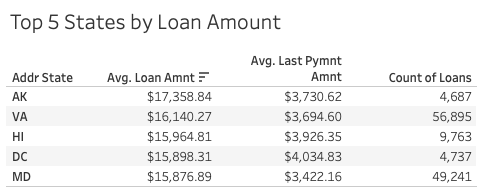
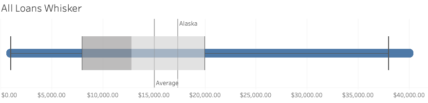
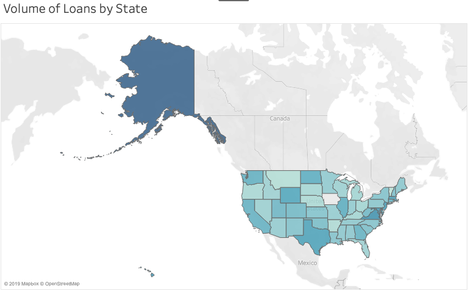
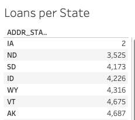
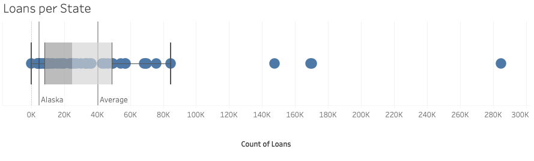
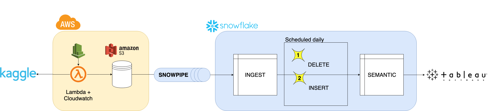

# LendingClub Data Engineering Project

 [](https://travis-ci.com/zack-klein/lendingclub) [](https://pypi.python.org/pypi/ansicolortags/)

Welcome!  This is the codebase for a **full** data analysis pipeline for the *LendingClub* loan data (which can be found on [Kaggle](https://www.kaggle.com/wendykan/lending-club-loan-data#loan.csv "Lending Club Loan Data")).  Everything in this repository was developed by **Zack Klein**.  For any questions, comments, concerns, or anything else, please reach out at klein.zachary.j@gmail.com.  All feedback is welcome!

You can find this analysis exposed at https://lending-club.zacharyjklein.com/

# A Note on Repository Structure
Before diving too deep, it's important to note there are two principal components to this project: the **app** of the data and the **pipeline** to keep the data fresh. These priorities are reflected in the directory structuring, as the two main folders in the root are `app` and `pipeline` (`docs` is there for images and such).  Essentially, each of these directories should be treated as the root directory of its own project (since, in a production environment, they would likely be separate).

The `app` directory, on the other hand, encompasses the *data science, analysis, and visualization* elements of the project (encompassed in a Flask app), and `pipeline` encompasses the *data engineering* elements. The Tableau dashboard on the site is also published on the Tableau Public server, [here](https://public.tableau.com/shared/HZ8RW8CS7?:display_count=yes&:origin=viz_share_link "Dashboard on Tableau Public") (please note that Tableau Public doesn't support a native Snowflake connection so the dashboard on the server is based on an extract of the data, while the workbook in this repo sits directly on top of Snowflake).

The directory structure, mapped out:
```
README.md
| docs
| app
  | ...
| pipeline
  | ...
```

# Background
From [Wikipedia](https://en.wikipedia.org/wiki/LendingClub):

```
LendingClub is a US peer-to-peer lending company, headquartered
in San Francisco, California. It was the first peer-to-peer lender
to register its offerings as securities with the Securities and
Exchange Commission, and to offer loan trading on a secondary market.
LendingClub is the world's largest peer-to-peer lending platform.
The company claims that $15.98 billion in loans had been originated
through its platform up to December 31, 2015.
```

To summarize, LendingClub offers loans using a peer-to-peer based model (which is really interesting).  They have provided (anonymized) data on these loans, which can lead to some rich analysis.  The data source they've provided details each loan from 2007-2015.  You can find a full description of the dataset on [Kaggle](https://www.kaggle.com/wendykan/lending-club-loan-data#loan.csv "Lending Club Loan Data").

# Part 1: Data Exploration and Evaluation
## What's the deal with all these loans?

The LendingClub data is especially interesting because it's the first at-scale digital peer-to-peer lending service to open source their data to the world (that I'm aware of).  That means the answers to some of the natural questions about peer-to-peer lending are available to those who are willing to look.  Questions like:
  1. What do people use money from peer-to-peer loans for?  
  2. Where do the people who use peer-to-peer lending live?  

To put a finer point on these questions, I'm particularly interested in analyzing the questions above through three lenses:

1. How are LendingClub loans distributed geographically (by State in the U.S.)?
2. How does the risk of the loan affect this distribution?  In this dataset, risk is measured on a scale from A -> G by a metric called *Loan Grade*, which is used to determine the loan's interest rate. More details [here](https://www.lendingclub.com/foliofn/rateDetail.action).
3. How does the purpose of the loan (why the money was borrowed) change across the U.S.?

These questions can be summed up into a more prompt business question:

**If LendingClub wanted to expand its presence by increasing the number of loans, where would it be most efficient to do so?**

This is the main question I set out to answer.

### Findings: Alaska - the last frontier!
*(As a reminder, the dashboard used for the findings below can be found [here](https://public.tableau.com/shared/HZ8RW8CS7?:display_count=yes&:origin=viz_share_link))*

I was surprised to find that neither loan risk nor loan purpose had much effect on the obvious candidate for expansion.  

The highest average loan (far and away) belongs to Alaska, at `$17,358.84` (averaged over all risk grades and all loan purposes).  This held constant even after filtering across risk grades (except risk grade F, where Hawaii beat out Alaska by $200) and the top 4 loan purposes (debt consolidation, credit card, other, & home improvement).  Here's the table averaged out over all risk grades and loan purposes:



We can see from this table that Alaska beats out Virginia for the the highest average loan by `$1,218.57` (a little less than `8%`).



Similarly, we can see from the above box and whisker plot that Alaska's average loan amount is significantly higher than the average loan amount in the US (also charted below):

```
# Alaska vs. Everyone Else
Alaska Mean Loan Amount: $17,358.84
U.S. Mean Loan Amount: $15,062.20
Difference: $2,296.64 (15.25%!)
```
For pure visualization, the map below shows the concentration of loan amount by each state (the darker the state, the higher the loan amount).




Perhaps most interestingly; one would expect that a difference this dramatic would have caught on - that lenders would have noticed that loans tended to be higher in Alaska, and that would lead to an abnormally high amount of loans in Alaska. But this is not the case.  In fact, it's quite the opposite: Alaska has the  the 7th *lowest* amount of loan counts across the United States.



Alaska's `4,687` loans place it **significantly** below the mean of loan counts in US states:



```
# Alaska vs. Everyone Else
Alaska Mean Loan Count: 4,687
U.S. Mean Loan Count: 40,605
Difference: 35,918
```

## Conclusion
Because the data shows 1) that the average loan amount is significantly higher than the average state and 2) that the total count of loans is significantly lower than the average state, LendingClub's most efficient means of expansion would be to increase the amount of loans in Alaska.

## Potential Improvements/Current Limitations

There are two main limitations to this analysis:
1. Population - This analysis doesn't consider population when evaluating the count of loans per state.  Because of this, states like California, Texas, and New York (with much higher populations) are much less likely to appear as efficient options, even though that may be the case.  A better metric for this analysis would be to measure the loan counts per state based on *loans per person* (# of loans/# of people), rather than nominal loan counts.

2. Time - This analysis doesn't consider time at all.  This data ranges from 2007 - 2015, but that is not reflected at all in the dashboard.  Theoretically, all of these loans could have happened on January 1st 2007, and then LendingClub could have been banned in Alaska on January 2nd, 2007, and that wouldn't be captured in the data.  For obvious reasons, this would disqualify Alaska as the most efficient source of expansion.  A better solution would be to include some kind of date component here.


# Part 2: Data Pipeline Engineering

The second part of this project is to design a pipeline to keep the data refreshed. Below is a diagram of the architecture used to accomplish this:



There are four layers in the pipeline:
1. The source layer (Kaggle)
2. The Ingestion/Data Lake layer (AWS)
3. The Data Warehouse layer (Snowflake)
4. The Analysis layer (Tableau)

and the pipeline is updated in three stages:
1. Ingestion into Data Lake
2. Ingestion into Data Warehouse
3. Transformations in the Data Warehouse.

## Priorities
Three architectural goals went into the development of this pipeline:
1. Simplicity
  - As stated in the challenge, a goal of this project is to prioritize *simplicity* in the processing code.  The bulk of this pipeline is accomplished by the code [in this file](https://github.com/zkleinn/zklein-loans/blob/master/pipeline/aws/lambda_function/get_data.py) and [this file](https://github.com/zkleinn/zklein-loans/blob/master/pipeline/snowflake/ddl/loans_poc_ddl.sql) and was written to be as simple as possible.
2. Cost-efficiency
  - This pipeline was written to be **cheap**. AWS Lambda & Tableau public are free (though a free Enterprise trial of Tableau was used to connect to Snowflake as a Data Source), and the AWS S3 requirements should be well within the free tier of usage.  The only part of this pipeline that costs money is Snowflake's storage and compute.
3. Scalability
  - This pipeline was built to be able to handle heavy amounts of data.  The `loan.csv` file this project uses is decently small (`~1GB`), so the pipeline was designed to handle more volume well.

## Data Model in Snowflake


## Walkthrough

### Assumptions

Since this data is static (currently), I made a few assumptions about the types of updates that *would potentially* happen with this data.

#### Insert-only Updates
Since the unique identifiers from this data source are redacted, I'm going to assume that all new data posted to Kaggle would be **new data** in the dataset.  In other words, I'm making the assumption that **no update logic** will ever be required (after all, if there are no unique identifiers, how could one determine which records were updates and which were inserts?).  Therefore, the pipeline I've designed reflects a system of continuous *inserts* (not *upserts*, as is often the case).

#### Under 5 minutes for Lambda function
I've opted for a *serverless* approach for this pipeline, which presents some limitations with volume. The big assumption is that the lambda function (which downloads the data and moves it to the S3 bucket) will take under 5 minutes to process.  This is entirely dependent on the size of the data used for the update.  An alternative to this approach would be to use an EC2 instance instead of a Lambda function.

### 1. Ingestion into Lake
This ingestion model is *pull* based.  An AWS Lambda function is called on a schedule from AWS Cloudwatch to download the data from Kaggle, then move it to an S3 bucket.  The function that accomplishes this is the `main()` in the `/pipeline/aws/lambda_function/get_data.py` file.  It uses the inputs from the `pipeline/config.py` file to specify the download.

[The Lambda function Python code can be found here.](https://github.com/zkleinn/zklein-loans/blob/master/pipeline/aws/lambda_function/get_data.py)

**Note:** The code in this repo is what *would* end up in a lambda function, and the Cloudwatch configuration would be built through the AWS UI so it's not included here.

**Future Improvement:** As mentioned in the *assumptions* section, this lambda function would save this data to a file and then load it to an S3 bucket.  There's a chance this will take longer than 5 minutes (the auto-shutdown time for AWS Lambda), and if it does, setting up an EC2 instance (that can run a function like this as long as necessary) would be a solid (but more expensive) way to ensure the data transfer to s3 never gets cut off.

### 2. Ingestion into Warehouse
A *snowpipe* is configured on the S3 bucket, so when a new file lands from the
previous step, it is auto-ingested into Snowflake.  This pipe ingests data into
a table called *LOANS_POC_INGEST*.  Every time new data hits the s3 bucket, it is **appended** to this ingestion table.

[The bulk copy command for the Snowpipe can be found here.](https://github.com/zkleinn/zklein-loans/blob/master/pipeline/snowflake/elt/bulk_copy.sql)

**Future improvement:**  A layer of data cleansing would be required in a production environment because the CSV contains some values with commas and is **not enclosed** by an escape character.  This results in most (but not all) of the data being loaded (accomplished by setting `on_error = 'continue'` in the `copy` command.)

### 3. Transformations in the Warehouse
2 *tasks* (new feature!) are scheduled to run daily in Snowflake that populate the
*LOANS_POC_SEMANTIC* table:
1. `DELETE FROM LOANS_POC_SEMANTIC`
  - The first task is to truncate the Semantic table to prep it for the new data that has been appended to the raw table.
2. `INSERT INTO LOANS_POC_SEMANTIC`
  - The second task is to insert all data from the four desired columns (see data model section) into the semantic table.  This will ensure the appended raw data makes it to the semantic table. There is a live connection to this table from Tableau, so the data is updated!

[Both of these tasks can be found here.](https://github.com/zkleinn/zklein-loans/blob/master/pipeline/snowflake/elt/update_pipeline.sql)


### Other Architectural Considerations/Potential Improvements
- Airflow orchestration
  - One of the main limitations of this pipeline is that there will be a few seconds/minutes of down time on the semantic table.  An easy way to get around this is to change the `truncate/insert` logic to `create table loans_semantic as select * from loans_ingest`, which is much faster and has **no downtime**.  Unfortunately, Snowflake `tasks` don't support `create` statements (learned this the hard way), so Airflow could be used to execute this command on a schedule. [This solution can be found here.](https://github.com/zkleinn/zklein-loans/blob/master/pipeline/snowflake/elt/update_pipeline.sql)

# Dependencies
## System:
- Developed on `macOS Mojave 10.14.5`

## Environments
- Amazon Web Services (AWS)
  - Lambda
  - S3
- Snowflake
- Tableau Desktop (Public & Free Trial)
- Kaggle

## Languages:
- `Python 3.7.1`
- `SnowSQL`

## Python Packages:
- `boto3`
- `s3fs`
- `kaggle`

## Author
Zack Klein, klein.zachary.j@gmail.com
